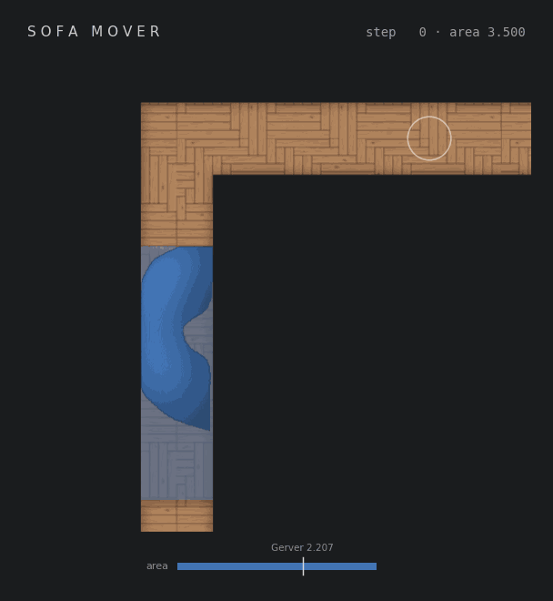

# Sofa Mover


A reinforcement learning environment for solving the Sofa-Moving Problem.




## Training

```bash
uv run python -m sofa_mover.training.train
```

## Visualization

A trajectory GIF is generated automatically at the end of training. To visualize a trained model manually:

```bash
uv run python -m sofa_mover.evaluate
```

This loads `output/best_policy.pt` and renders a greedy rollout to `output/agent_trajectory.gif`.

To render a specific checkpoint after training:

```bash
uv run python -c "from sofa_mover.evaluate import evaluate; evaluate('output/final_policy.pt', 'output/final_policy.gif')"
```


## Post-training trajectory optimization

The trained discrete-action policy snaps to a coarse action grid, leaving easy
local improvements on the table. After training finishes, the best trajectory
recorded during training is refined with the Cross-Entropy Method (CEM) over
continuous `(dx, dy, dθ)` deltas, then rendered to `output/optimized_trajectory.gif`.

To run the optimization manually against a saved checkpoint:

```bash
uv run python -m sofa_mover.optimize_trajectory \
    --checkpoint output/best_policy.pt \
    --output output/optimized_trajectory.gif \
    --iters 600 --pop-size 128
```

The script also exposes `optimize_trajectory(...)` / `optimize_from_checkpoint(...)`
in `sofa_mover.optimize_trajectory` for programmatic use.

## Profiling

To generate a flame graph for the default training run:

```bash
uv run --with py-spy python -m sofa_mover.training.flamegraph
```

This writes `output/default_training_flamegraph.svg`. Open it in a browser to inspect the interactive flame graph.
